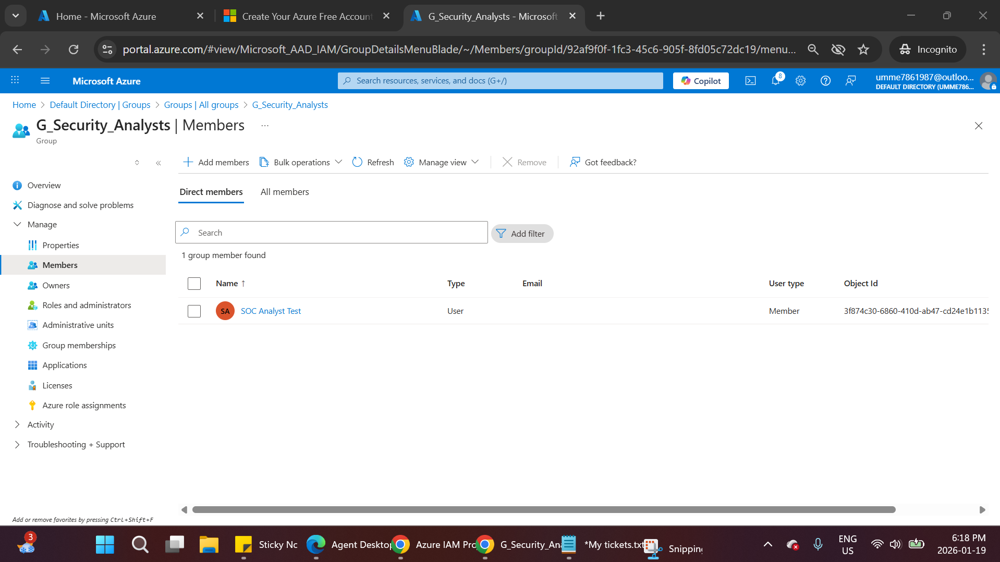
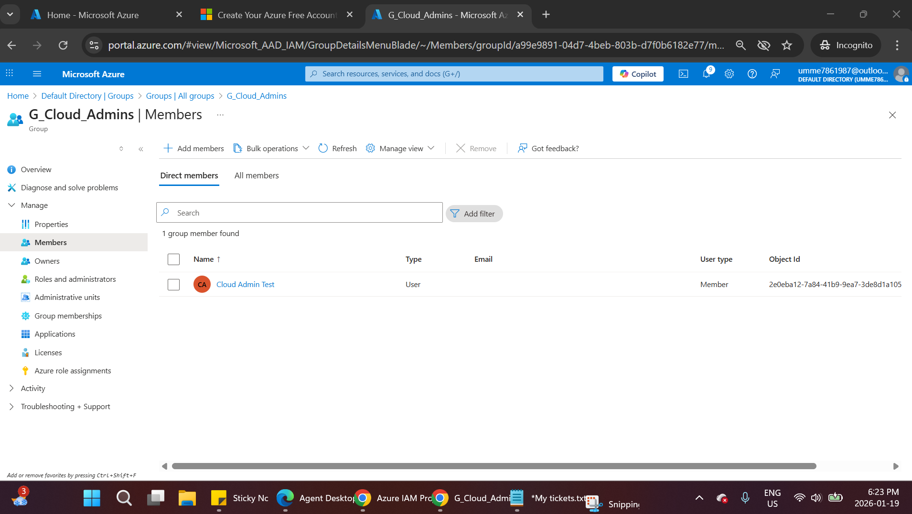
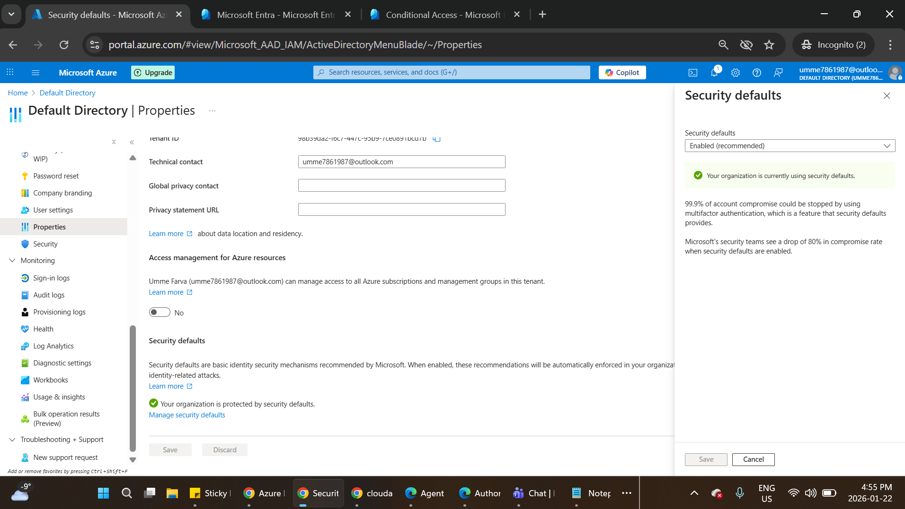

# Azure IAM & Cloud Security Lab

This project demonstrates the implementation of **Identity and Access Management (IAM)** and **core cloud security controls** in **Microsoft Azure** using **Microsoft Entra ID**.

The lab focuses on managing users and groups, applying **Role-Based Access Control (RBAC)** with least privilege, enforcing **Multi-Factor Authentication (MFA)** using Microsoft Security Defaults, and reviewing **sign-in and audit logs**. These activities reflect real-world identity and access management tasks performed by SOC and cloud security teams.

---

## Project Overview

The objectives of this lab were to:

- Create users and security groups in Microsoft Entra ID
- Apply RBAC using the principle of least privilege
- Test authorized vs unauthorized access to Azure resources
- Enforce MFA using Microsoft-recommended security defaults
- Review sign-in and audit logs for identity visibility

---

## Lab Environment

### Cloud Platform
- Microsoft Azure Portal
- Azure Free Tier subscription

### Identity Service
- Microsoft Entra ID (Azure Active Directory)

### Security Controls
- Role-Based Access Control (RBAC)
- Security Defaults (MFA enforcement)

---

## Tools Used

- **Microsoft Azure Portal** – Cloud resource management
- **Microsoft Entra ID** – Identity and access management
- **Azure RBAC** – Role-based access control
- **Security Defaults** – MFA enforcement
- **Azure Sign-in Logs** – Authentication monitoring
- **Azure Audit Logs** – Identity activity tracking

---

## Identity & Access Configuration

### Users Created
- SOC Analyst Test
- Cloud Admin Test

---

### Security Groups Created
- G_Security_Analysts
- G_Cloud_Admins

---

### Group Membership Assignment
- SOC Analyst Test → G_Security_Analysts
- Cloud Admin Test → G_Cloud_Admins

---

## Resource Group & RBAC

### Resource Group
- **Name:** `RG-CloudSecurity-IAM`

---

### Role Assignments (Least Privilege)
- G_Security_Analysts → **Reader**
- G_Cloud_Admins → **Contributor**

---

## Access Testing & Validation

### SOC Analyst Test (Restricted Access)
The SOC Analyst attempted to create a storage account and was denied access, confirming least privilege enforcement.

---

### Cloud Admin Test (Authorized Access)
The Cloud Admin successfully created a storage account inside the resource group.

---

## Multi-Factor Authentication (MFA)

### MFA Implementation
- MFA enforced using **Microsoft Security Defaults**
- Used as a secure baseline when Conditional Access requires premium licensing

MFA enforcement was validated through sign-in activity.

---

## Logging & Monitoring

### Sign-in Logs
Azure sign-in logs were reviewed to confirm:
- Successful and failed logins
- MFA challenges
- User, IP address, and location details

---

### Audit Logs
Audit logs were reviewed to track identity-related activities such as:
- User creation
- Group creation
- Role assignments
- Security configuration changes

---

## Key Learnings

- RBAC is essential for enforcing least privilege in cloud environments
- Group-based access management simplifies role administration
- Security Defaults provide strong baseline MFA protection
- Identity logs are critical for SOC monitoring and investigations

---

## **Data Privacy Note**

This lab was performed in a controlled Azure test environment.  
All users, resources, and logs are test-only.  
No personal or production data is included.

---

## **Author**

**Umme Farva**  
Cybersecurity Analyst
